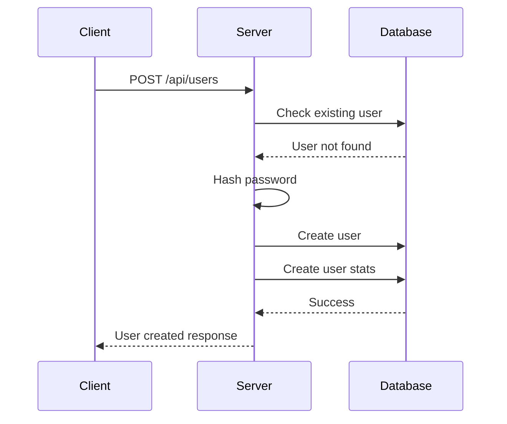
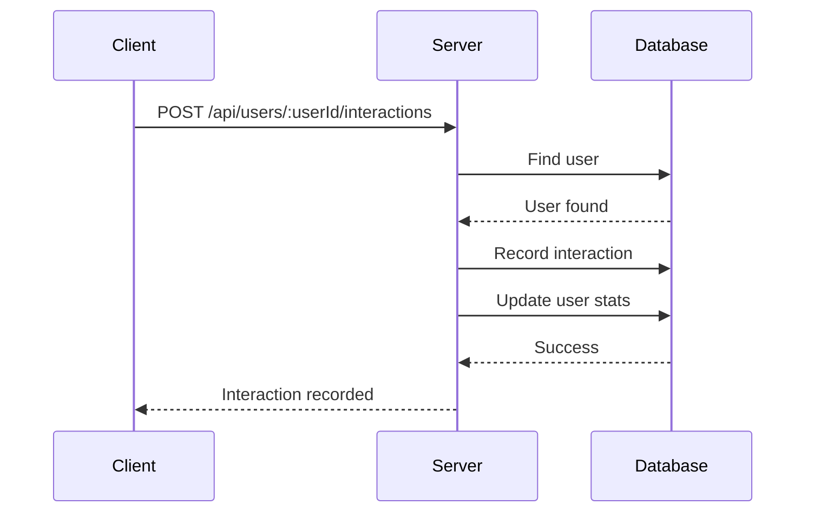
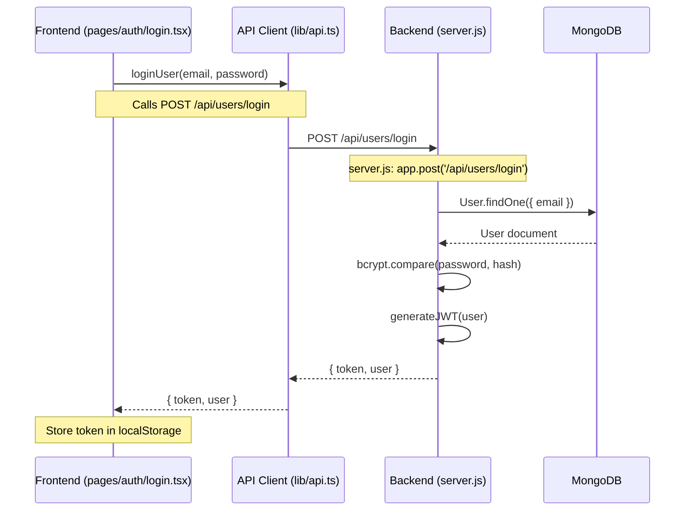
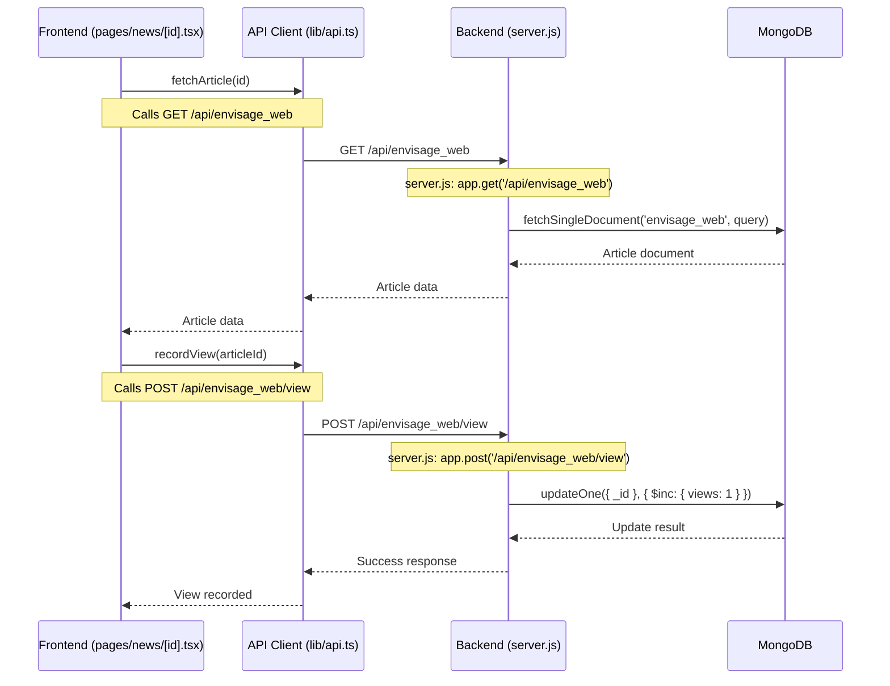
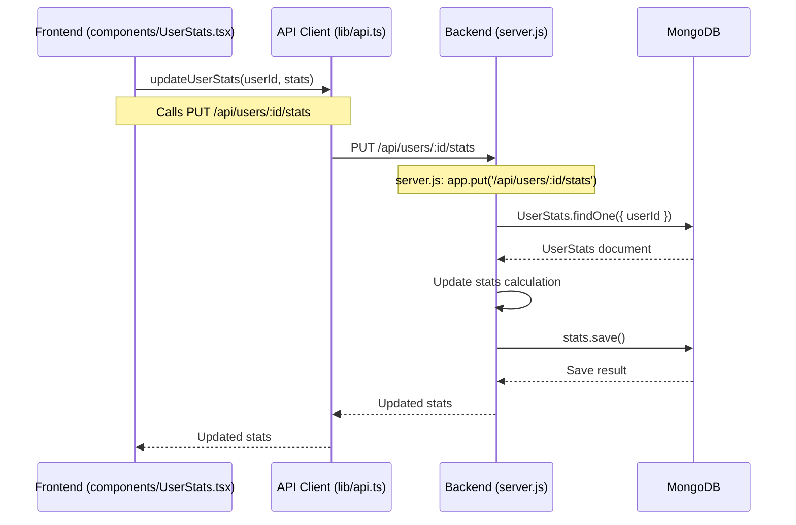
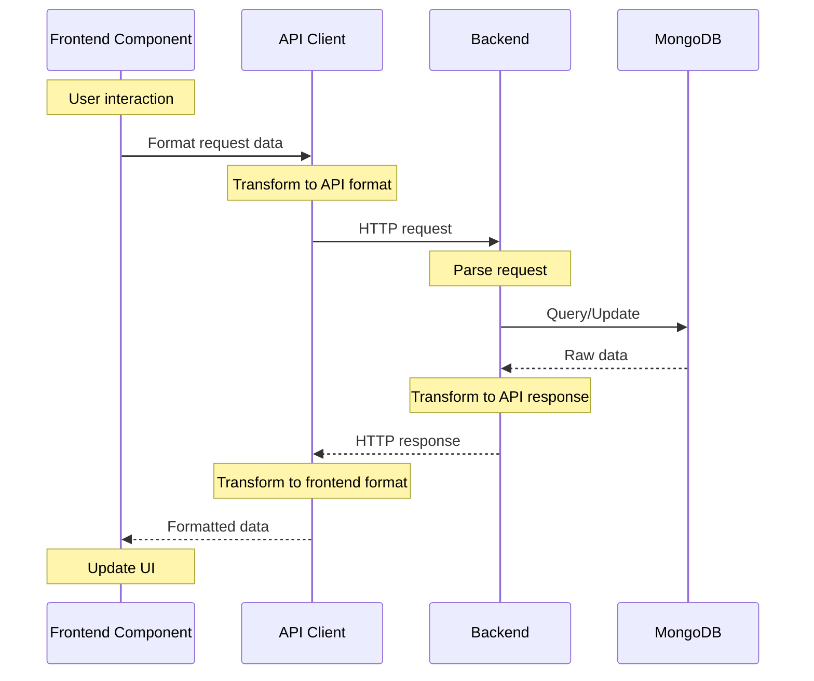
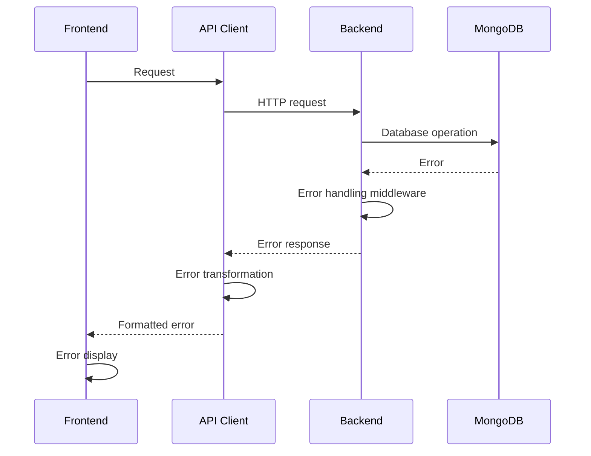

# Backend Architecture Documentation

## Table of Contents
1. [Folder Structure](#folder-structure)
2. [Component Architecture](#component-architecture)
3. [Database Schema](#database-schema)
4. [API Endpoints](#api-endpoints)
5. [Sequence Diagrams](#sequence-diagrams)
6. [Data Flow](#data-flow)

## Folder Structure

```
backend/
├── server.js                 # Main server entry point
├── lib/
│   └── mongodb.js           # MongoDB connection and utility functions
├── models/                   # Mongoose schema definitions
├── routes/                   # API route handlers
└── middleware/              # Custom middleware functions
```

## Component Architecture

### Core Components

1. **Server (server.js)**
   - Express application setup
   - Middleware configuration
   - Route registration
   - Database connection management
   - Environment configuration

2. **Database Layer (lib/mongodb.js)**
   - MongoDB connection management
   - Database utility functions
   - Query builders
   - Error handling

3. **Models**
   - User Schema
   - UserStats Schema
   - Article Schema
   - UserArticleInteraction Schema

### Data Models

#### User Schema
```javascript
{
  email: String (required, unique),
  password: String,
  name: String (required),
  profilePicture: String,
  authProvider: String (enum: ['email', 'google', 'github']),
  authProviderId: String,
  isActive: Boolean,
  createdAt: Date,
  lastLogin: Date
}
```

#### UserStats Schema
```javascript
{
  userId: ObjectId (ref: 'User'),
  totalTimeSpent: Number,
  cardReadingTime: Number,
  articlesRead: Number,
  lastActivity: Date,
  dailyStats: [{
    date: Date,
    timeSpent: Number,
    articlesRead: Number
  }],
  categoryEngagement: Map
}
```

#### Article Schema
```javascript
{
  title: String,
  content: String,
  summary: String,
  category: String,
  dayTimeCategory: String,
  author: ObjectId (ref: 'User'),
  publishDate: Date,
  viewCount: Number,
  totalTimeSpent: Number,
  averageReadTime: Number,
  tags: [String],
  isActive: Boolean
}
```

#### UserArticleInteraction Schema
```javascript
{
  userId: ObjectId (ref: 'User'),
  articleId: ObjectId (ref: 'Article'),
  documentId: String,
  newsItems: [{
    newsItemId: Number,
    timeSpent: Number,
    completed: Boolean,
    interactionDate: Date
  }],
  timeSpent: Number,
  completed: Boolean,
  interactionDate: Date
}
```

## API Endpoints

### User Management
- `POST /api/users` - Create new user
- `GET /api/users` - Get all users (paginated)
- `GET /api/users/:id` - Get single user
- `PUT /api/users/:id` - Update user
- `DELETE /api/users/:id` - Delete user

### User Stats
- `GET /api/users/:id/stats` - Get user stats
- `PUT /api/users/:id/stats` - Update user stats
- `POST /api/users/:id/daily-stats` - Add daily stats

### Article Interactions
- `POST /api/users/:userId/interactions` - Record article interaction
- `GET /api/users/:userId/interactions` - Get user interactions
- `POST /api/articles/:id/view` - Increment article view count

### News and Content
- `GET /api/envisage_web` - Fetch news content
- `POST /api/envisage_web/view` - Increment news item view count
- `GET /api/envisage_web/all` - Get all news documents

## Sequence Diagrams

### User Registration Flow


### Article Interaction Flow


## Data Flow

### News Content Flow
1. News content is stored in MongoDB
2. Content is organized by date and time categories
3. Each news item has:
   - Basic metadata (title, summary, category)
   - View count tracking
   - User interaction tracking

### User Interaction Flow
1. User views/interacts with content
2. Interaction is recorded
3. User stats are updated
4. Category engagement is tracked
5. Daily stats are maintained

### View Count Flow
1. Content view is initiated
2. View count is incremented
3. User interaction is recorded
4. Stats are updated

## Security Considerations

1. **Authentication**
   - Multiple auth providers (email, Google, GitHub)
   - Password hashing using bcrypt
   - JWT token management

2. **Data Protection**
   - Input validation
   - Data sanitization
   - Error handling

3. **API Security**
   - CORS configuration
   - Rate limiting
   - Request validation

## Error Handling

1. **Database Errors**
   - Connection failures
   - Query errors
   - Validation errors

2. **API Errors**
   - Invalid requests
   - Authentication failures
   - Resource not found

3. **Business Logic Errors**
   - Invalid operations
   - State conflicts
   - Data inconsistencies

## Performance Considerations

1. **Database Optimization**
   - Indexed fields
   - Efficient queries
   - Connection pooling

2. **API Optimization**
   - Pagination
   - Response caching
   - Request batching

3. **Resource Management**
   - Connection pooling
   - Memory management
   - Error recovery

## Detailed Sequence Flows

### Complete Frontend to Backend Flow

#### User Authentication Flow


#### News Article View Flow


#### User Stats Update Flow


### File Structure and Function Mapping

#### Frontend Files
1. **pages/auth/login.tsx**
   - `loginUser(email, password)`
   - `handleLogin()`
   - `handleGoogleLogin()`

2. **pages/news/[id].tsx**
   - `fetchArticle(id)`
   - `recordView(articleId)`
   - `handleInteraction()`

3. **components/UserStats.tsx**
   - `updateUserStats(userId, stats)`
   - `fetchUserStats(userId)`
   - `calculateDailyStats()`

#### Backend Files
1. **server.js**
   - `app.post('/api/users/login')`
   - `app.get('/api/envisage_web')`
   - `app.put('/api/users/:id/stats')`

2. **lib/mongodb.js**
   - `connectToDatabase()`
   - `fetchSingleDocument()`
   - `fetchFromCollection()`

3. **models/User.js**
   - `UserSchema`
   - `UserStatsSchema`

### Data Transformation Flow



### Error Handling Flow

