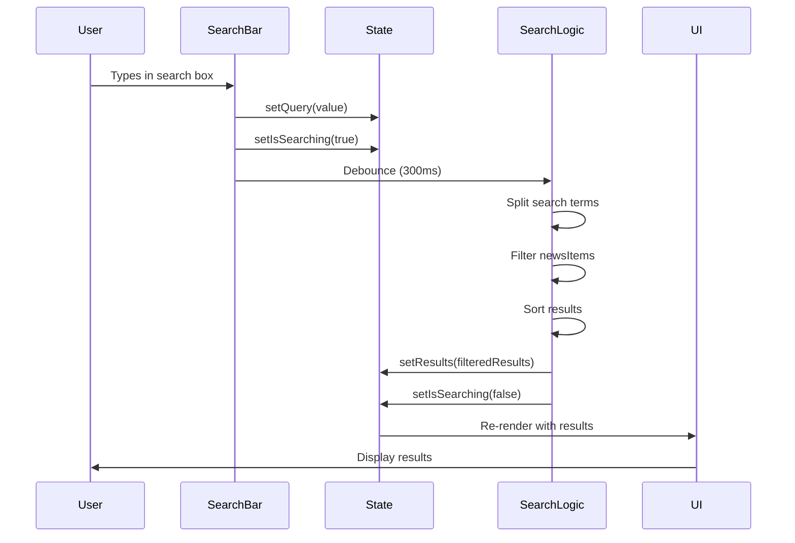

# Search Feature Technical Specification

## Overview
The search feature is a real-time, client-side search implementation that provides instant filtering and navigation capabilities for news items. It uses a combination of React hooks, state management, and UI components to deliver a smooth user experience.

## Data Structures

### 1. SearchResult Interface
```typescript
interface SearchResult {
  id: number;
  title: string;
  summary: string;
  category: string;
  slug: string;
  image: string;
}
```

### 2. Component Props
```typescript
interface SearchBarProps {
  onSearch: (results: SearchResult[]) => void;
  onSelect: (slug: string) => void;
  newsItems: SearchResult[];
}
```

## Sequence Diagram



## Technical Implementation Details

### 1. State Management
- Uses React's `useState` for local state management
- Key states:
  - `open`: Controls search dialog visibility
  - `query`: Current search input
  - `results`: Filtered search results
  - `isSearching`: Loading state indicator

### 2. Performance Optimizations
- **Debouncing**: 300ms delay to prevent excessive searches
- **Memoization**: `useMemo` for results list to prevent unnecessary re-renders
- **Callback Optimization**: `useCallback` for event handlers

### 3. Search Algorithm
```typescript
const searchTerms = value.toLowerCase().split(' ');
const filteredResults = newsItems.filter(item => {
  const searchableText = `
    ${item.title} 
    ${item.summary} 
    ${item.category}
  `.toLowerCase();
  return searchTerms.every(term => searchableText.includes(term));
});
```

### 4. UI Components
- `CommandDialog`: Modal search interface
- `CommandInput`: Search input field
- `CommandList`: Results container
- `CommandGroup`: Results grouping
- `CommandItem`: Individual result item

## Issues Found and Fixed

### 1. Results Not Displaying
**Issue**: Search results were found but not displayed in UI
**Root Cause**: Missing `value` prop in `CommandItem` components
**Fix**: Added required `value` prop to `CommandItem`
```typescript
<CommandItem
  key={result.id}
  value={result.title}  // Added this line
  onSelect={() => {
    onSelect(result.slug);
    setOpen(false);
  }}
>
```

### 2. State Synchronization
**Issue**: Race condition in search state updates
**Root Cause**: Asynchronous state updates not properly handled
**Fix**: Made search function async and added proper state management
```typescript
searchTimeoutRef.current = setTimeout(async () => {
  await performSearch(value);
  setIsSearching(false);
}, 300);
```

### 3. Performance Issues
**Issue**: Unnecessary re-renders of results list
**Root Cause**: Missing memoization
**Fix**: Implemented `useMemo` for results list
```typescript
const resultsList = useMemo(() => {
  return results.map((result) => (
    <CommandItem ... />
  ));
}, [results, onSelect]);
```

## Technical Stack

### Frontend
- React 18+
- TypeScript
- Tailwind CSS
- shadcn/ui Components

### Key Dependencies
- `lucide-react`: Icons
- `@/components/ui/*`: Custom UI components
- React Hooks: `useState`, `useEffect`, `useCallback`, `useMemo`, `useRef`

## Performance Metrics
- Search response time: < 300ms (debounced)
- Memory usage: O(n) where n is number of news items
- Time complexity: O(n * m) where m is number of search terms

## Future Improvements
1. Implement server-side search for larger datasets
2. Add search result highlighting
3. Implement search history
4. Add keyboard navigation improvements
5. Implement search analytics

## Testing Considerations
1. Unit tests for search algorithm
2. Integration tests for component interactions
3. Performance testing for large datasets
4. Accessibility testing
5. Cross-browser compatibility testing 